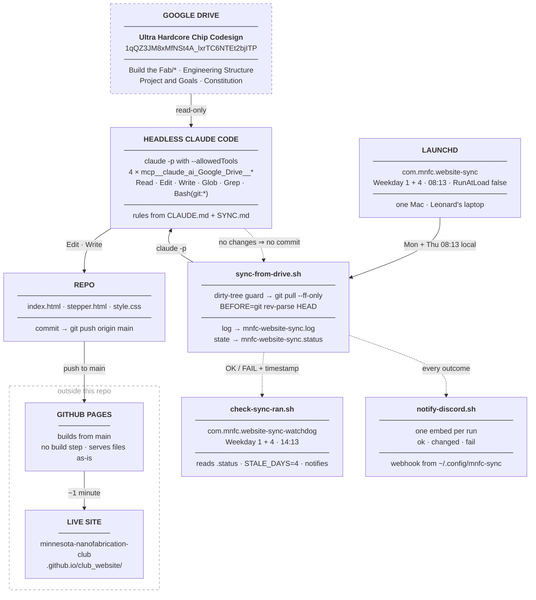

# Architecture Overview

The club website is a static site that rewrites itself twice a week — Monday and Thursday —
from the club's Google Drive. This page traces one run end to end — Drive, the scheduled job,
the headless agent, the push, the rebuild — and states the dependency rule that keeps the
pieces from fighting each other. **Drive is authoritative over the repo, and the repo is authoritative
over the live site. Nothing flows backwards.**

---

## The pipeline

**Dependency rule:** each stage reads only from the stage above it. Drive never reads the
repo, and the repo never reads the site. The three dashed edges carry no content — one is the
no-op, the agent reporting that nothing changed and suppressing the commit; one is the run's
own outcome, written to a status file the watchdog reads later; the third is the same outcome
posted to Discord. None of them can fail the run.

---

## What runs, in order

A single run is nine steps in `scripts/sync-from-drive.sh`, and every one of them appends to
the same log:

| # | Step | Failure behavior |
| --- | --- | --- |
| 1 | Write a `═` divider and `Sync started: <date>` to the log | — |
| 2 | `cd "$REPO"` | `FATAL: repo not found`, `record FAIL`, notify, exit 1 |
| 3 | Dirty-tree guard: `git diff --quiet` and `git diff --cached --quiet` | `SKIP: uncommitted local changes present; not syncing over them.`, prints `git status --short`, `record FAIL`, notify, `discord fail`, **exit 0** |
| 4 | `git pull --ff-only origin main` | `FATAL: git pull failed`, `record FAIL`, notify, `discord fail`, exit 1 |
| 5 | `BEFORE=$(git rev-parse HEAD)` | — |
| 6 | `claude -p "<prompt>"` with a scoped `--allowedTools` list, piped through `tee "$AGENT_OUT"` | delegated to the agent |
| 7 | `STATUS=${PIPESTATUS[0]}`, `AFTER=$(git rev-parse HEAD)` | — |
| 8 | Result branch: `RESULT: claude exited $STATUS` / `RESULT: no changes committed.` / `RESULT: committed $BEFORE -> $AFTER` | on the committed branch, verify the push and retry once; every branch calls `record` and `discord` |
| 9 | `Sync finished: <date>` | — |

The script runs under `set -uo pipefail` — deliberately **not** `-e`. It does its own
checks at every step and needs the non-zero exits to reach its own logging branches rather
than killing the shell mid-run.

!!! danger "Step 7 reads `${PIPESTATUS[0]}`, not `$?`"
    The agent's output is piped through `tee` so a copy lands in `AGENT_OUT` for the Discord
    `fail` embed. `$?` after a pipeline is the *last* command's status — `tee`'s — and `tee`
    exits `0` no matter how the agent exited. Reading `$?` would route every crashed run into
    the `BEFORE = AFTER` branch, logging `RESULT: no changes committed.`, recording
    `OK  no changes`, and posting a grey `✓ Site checked` embed. Every failure would look like
    a clean quiet run on every channel at once.

!!! warning "The dirty-tree guard exits 0, but still reports FAIL"
    Step 3 is a soft exit on purpose — a dirty tree means someone was editing the repo by
    hand, and the correct response is to leave that work alone rather than sync over it.
    But it is not a quiet outcome: the skip is **self-perpetuating**, because until the
    tree is committed or stashed every following run skips too and the site keeps drifting
    from Drive. So the branch writes `FAIL` to the status file, raises a notification and
    posts a `fail` embed to Discord even though the process exits 0.

---

## The scoped tool allowlist

Step 6 launches Claude Code headlessly with an explicit `--allowedTools` list — four
Google Drive tools plus a small local set:

| Tool | Why it is on the list |
| --- | --- |
| `mcp__claude_ai_Google_Drive__search_files` | enumerate the subfolders of `Build the Fab` |
| `mcp__claude_ai_Google_Drive__read_file_content` | read the docs `SYNC.md` names |
| `mcp__claude_ai_Google_Drive__get_file_metadata` | resolve folder and file identity |
| `mcp__claude_ai_Google_Drive__list_recent_files` | spot what moved since the last run |
| `Read`, `Edit`, `Write`, `Glob`, `Grep` | read and rewrite `index.html` / `stepper.html` |
| `Bash(git:*)` | `git commit` and `git push origin main` — nothing else |

The Drive side is read-only by construction: no Drive write tool appears on the list, so
a confused run cannot edit the club's documents. The local side is narrowed to `git`, so
the agent cannot reach `launchctl`, the plist, or anything outside the repo. The prompt
itself restates the publishing rules and points at `CLAUDE.md` first and `SYNC.md` second,
so the rules survive even if the tool list is later widened.

---

## The dependency rule, stated as a rule

**Drive → repo → site. Nothing flows backwards.**

- **Drive is authoritative over the repo.** Project scope, status, timelines, roles and
  mission framing are decided in Drive documents; the HTML is a rendering of them.
- **The repo is authoritative over the live site.** Pages serves the files exactly as they
  are committed — no build step, no framework, no compile. There is no other place a
  change to the published page can come from.
- **Neither arrow reverses.** The agent never writes to Drive, and nothing edits the
  deployed site outside a push to `main`.

### What breaks if you hand-edit project copy in the HTML

**Hand-edits to project copy do not survive.** The agent does not diff your edit against
anything — it rewrites the affected section from the Drive documents each run, so at 08:13 on
the next Monday or Thursday your sentence is replaced by whatever Drive says, silently, with a
commit message describing the change as a sync. Nobody is notified, and the only record is
a line in `~/Library/Logs/mnfc-website-sync.log` on one laptop, plus a `↻ Site updated` embed
in Discord whose headline is that commit's subject.

This has been demonstrated, not assumed: on 2026-08-18 the Etcher entry was deleted from
`index.html` and committed (`0593a4a`), and the next sync restored it (`7dd018c`) without
being asked to. The write-back path works in exactly the direction that erases local
content edits.

The split that matters:

| Change | Safe to make in the repo? |
| --- | --- |
| Project name, status, description, timeline rows | **No** — change the Drive doc instead |
| Team names and roles | **No** — change `Engineering Structure` |
| HTML structure, `style.css`, nav, layout | Yes — design is not Drive-sourced |
| The four deliberately non-Drive links and `jin00404@umn.edu` | Yes, and they must be **preserved** — see [Design Principles](design-principles.md) |

!!! tip "Run it early instead of editing the HTML"
    If Drive is already correct and the site is stale, do not patch the HTML — run
    `./scripts/sync-from-drive.sh` by hand, or ask Claude Code in this repo to
    "Sync the club website from Google Drive following SYNC.md." Both take the same path
    the scheduled job takes, so the result is what the next run would have produced anyway.

---

## How a failed run reports itself

The job is unattended, so the log alone is not a reporting channel — nobody opens a log
file to confirm that nothing went wrong. Three side channels close that gap, and all of them
are documented in full in [Notifications](../operations/notifications.md).

**The status file.** `record <state> <detail>` writes one tab-separated line —
state, timestamp, detail — to `~/Library/Logs/mnfc-website-sync.status`, overwriting the
previous run. Every branch calls it: `OK "no changes"`, `OK "committed $AFTER"`,
`OK "committed $AFTER (pushed on retry)"`, or `FAIL` with the reason.

**The notification.** `notify` shells out to `osascript` for a macOS notification titled
`Website sync`. Only failure paths call it. Success stays silent deliberately — a
"nothing changed" popup twice a week trains the reader to dismiss the notification they
actually need to read.

**Discord.** `scripts/notify-discord.sh` posts one embed per run to an incoming webhook —
grey `✓ Site checked` for a quiet run, maroon `↻ Site updated` for a commit, red
`✗ Sync failed` for any failure. `ok`, `changed` and `fail` all carry an @mention when `discord-mention` is configured.
the commit subject from `git log -1 --format=%s`, not text parsed out of the agent's prose.
The webhook URL is a secret and lives in `~/.config/mnfc-sync/discord-webhook`, never in the
repo; when it is absent the script prints one line and exits `0`, so the sync never fails
because Discord is unconfigured.

**The watchdog.** `scripts/check-sync-ran.sh` runs as a second launchd job,
`com.mnfc.website-sync-watchdog`, on Mondays and Thursdays at 14:13 — six hours after each
sync is due. It
exists because the sync cannot report the one failure that matters most: **not running at
all.** A job that never fires writes no log line, sets no exit code, posts nothing to Discord,
and looks exactly like a quiet run. The watchdog reads the status file instead of the log and
notifies when:

| Condition | Notification |
| --- | --- |
| No status file exists | No sync has ever recorded a run — the schedule may not be installed |
| `STATE` is `FAIL` | Last sync failed, with the recorded detail |
| Status file older than `STALE_DAYS=4` | No sync in N days — was the Mac off? |

It first checks `launchctl list` for a currently-running sync and exits early if it finds
one, because both jobs fire together when the Mac wakes from a long sleep and the watchdog
would otherwise race the run it is meant to be checking.

---

## Moving parts and where each lives

| Part | Identifier / location |
| --- | --- |
| Drive root folder | **Ultra Hardcore Chip Codesign**, id `1qQZ3JM8xMfNSt4A_lxrTC6NTEt2bjITP` |
| Sync script | `scripts/sync-from-drive.sh` |
| Schedule installer | `scripts/install-schedule.sh` (`install` / `uninstall` / `status`) — installs both jobs |
| Watchdog script | `scripts/check-sync-ran.sh` |
| Discord notifier | `scripts/notify-discord.sh`; webhook in `~/.config/mnfc-sync/discord-webhook`, optional mention in `~/.config/mnfc-sync/discord-mention` |
| launchd label — sync | `com.mnfc.website-sync`, Weekday `1` **and** `4`, Hour `8`, Minute `13` |
| launchd label — watchdog | `com.mnfc.website-sync-watchdog`, Weekday `1` **and** `4`, Hour `14`, Minute `13` |
| launchd plists | `~/Library/LaunchAgents/com.mnfc.website-sync.plist` and `…-watchdog.plist`; `RunAtLoad` false on both |
| Log (stdout and stderr, both jobs) | `~/Library/Logs/mnfc-website-sync.log` |
| Status file | `~/Library/Logs/mnfc-website-sync.status` |
| `claude` binary | `/Users/leonardjin/.local/bin/claude` |
| Repo checkout | `/Users/leonardjin/Dev/ultra-hardcore-chip-codesign/club_website` |
| Published site | `https://minnesota-nanofabrication-club.github.io/club_website/` |
| Rules the agent reads | `CLAUDE.md` first, then `SYNC.md` |

!!! warning "Every one of those paths is absolute and hardcoded"
    `REPO`, `CLAUDE` and `SCRIPT` are literal absolute paths in the two scripts, and the
    plists embed the script paths. The sync therefore runs from exactly one machine — if
    that Mac is replaced, wiped, or its user account renamed, both jobs stop together, and
    the watchdog that would have reported the silence is the thing that stopped. Nothing
    off that machine observes the site at all. Re-pointing the paths and re-running
    `./scripts/install-schedule.sh` is the whole recovery, but nothing triggers it
    automatically.

---

## Where the site can fail to update

Three states look the same from outside — a site that has not changed — and only the log
tells them apart:

| Log line | Status file | What it means |
| --- | --- | --- |
| `RESULT: no changes committed.` | `OK  no changes` | **Success.** Drive matched the site; rule 7 says make no commit |
| `SKIP: uncommitted local changes present…` | `FAIL  uncommitted local changes` | The tree was dirty; the job deliberately did nothing, and will skip again on every following run until it is cleaned up |
| `RESULT: claude exited $STATUS` | `FAIL  claude exited $STATUS` | The agent failed; the site was not updated |
| `ERROR: push failed.` | `FAIL  commit $AFTER not pushed` | The commit exists locally only — the tree is clean, so nothing trips the next run's guard |
| *(no new entry at all)* | *unchanged, and ageing* | The Mac was off or asleep through the slot, or launchd is not loaded — this is the case the watchdog exists to catch |

An asleep Mac is not a failure: launchd runs a missed calendar job when the machine next
wakes. A machine that was off through a whole slot simply skips that run, and the following
run — at most four days later — picks up every accumulated change at once, because the agent
diffs Drive against the current HTML rather than replaying a queue.

!!! note "Verification history"
    The full launchd-triggered path was confirmed on 2026-08-19: `launchctl kickstart`
    fired the job, the Drive connector authenticated under launchd's minimal environment,
    and the run correctly made no commit because Drive matched the site. SSH push was
    separately confirmed with `env -i` plus `git push --dry-run`, proving it does not
    depend on a shell-provided `ssh-agent`.

---

## Why local rather than a cloud routine

A scheduled cloud routine was the first design, and it does not work. Cloud routines get a
**read-only** GitHub token on this repo, so `git push` and the GitHub API both return
`403`; granting write access requires a Claude Team/Enterprise plan. On the laptop, git
already has push access over SSH, so the identical loop closes at no extra cost.

The cloud routine still exists but is **disabled**. Do not re-enable it without fixing the
permission first — a re-enabled routine would run the sync, edit the HTML, and then fail at
the push, leaving the run's work stranded in a checkout nobody looks at.

The tradeoff is stated above: the job now depends on one specific Mac being on.

---

## Read next

| Page | Covers |
| --- | --- |
| [**Design Principles**](design-principles.md) | The non-negotiable rules — never invent content, the roster rule, what is never published |
| [**Data Contracts**](../data-contracts.md) | Which Drive folder feeds which page section, and the HTML entry shapes |
| [**Schedule**](../operations/schedule.md) | Installing, checking and removing the two launchd jobs |
| [**Sync Run**](../operations/sync-run.md) | Reading the log, and what to do about a failed run |
| [**Notifications**](../operations/notifications.md) | The log, the status file, macOS banners and Discord — what fires when |
