# Architecture Overview

The club website is a static site that proposes its own updates twice a week — Monday and
Thursday — from the club's Google Drive. This page traces one run end to end — Drive, the
service-account mirror, the hosted agent, the guard, the proposal branch, the pull request, a
human merge, the rebuild — and states the dependency rule that keeps the pieces from fighting
each other. **Drive is authoritative over the repo, and the repo is authoritative over the
live site. Nothing flows backwards, and nothing crosses the `main` boundary without a human
merging it.**

---

## The pipeline

```mermaid
flowchart TD
    DRIVE["<b>GOOGLE DRIVE</b><br/>──────────────────────────<br/><b>Ultra Hardcore Chip D&amp;F</b><br/>1qQZ3JM8xMfNSt4A_lxrTC6NTEt2bjITP<br/>──────────────────────────<br/>Build the Fab/* · Engineering Structure<br/>Project and Goals · Constitution"]

    CRON["<b>GITHUB ACTIONS</b><br/>──────────────────────────<br/>.github/workflows/sync-from-drive.yml<br/>cron 13 13 * * 1,4 · workflow_dispatch<br/>──────────────────────────<br/>ubuntu-latest · 45 min · fresh container"]

    MIRROR["<b>scripts/fetch_drive.py</b><br/>──────────────────────────<br/>service account · read-only scope<br/>exports Docs/Sheets/Slides to text<br/>──────────────────────────<br/>$RUNNER_TEMP/drive · never in the repo"]

    AGENT["<b>claude-code-action@v1</b><br/>──────────────────────────<br/>--model claude-opus-5 · --max-turns 200<br/>Read · Write · Edit · Glob · Grep · Bash(git:*)<br/>──────────────────────────<br/>commit only · no push · no branch switch"]

    GUARD["<b>THE GUARD</b><br/>──────────────────────────<br/>git diff --name-only vs pre-run SHA<br/>docs/ .github/ scripts/ mkdocs.yml<br/>README.md CLAUDE.md SYNC.md<br/>──────────────────────────<br/>any hit ⇒ fail, nothing pushed"]

    BRANCH["<b>BRANCH — sync/drive</b><br/>──────────────────────────<br/>push --force-with-lease from current main<br/>index.html · machine subpages · style.css"]

    PR["<b>PULL REQUEST</b><br/>──────────────────────────<br/>gh pr create --base main --head sync/drive<br/>at most one open at a time<br/>──────────────────────────<br/>quiet run ⇒ nothing closes it"]

    HUMAN["<b>HUMAN REVIEW</b><br/>──────────────────────────<br/>checks every claim against Drive<br/>roster · leads · internal material · links<br/>──────────────────────────<br/><b>the merge is the publish</b>"]

    MAIN["<b>REPO — main</b><br/>──────────────────────────<br/>what is published now<br/>──────────────────────────<br/>changes only by merge"]

    NOTES["<b>DRIVE_NOTES.md</b><br/>──────────────────────────<br/>agent-maintained observations<br/>every entry has a REMOVE WHEN<br/>──────────────────────────<br/>cap 20 · not guard-protected"]

    REPORT["<b>REPORTING</b><br/>──────────────────────────<br/>job summary · Discord embed<br/>drive-sync-failure issue<br/>──────────────────────────<br/>ok · proposed · fail"]

    subgraph EXT ["outside this repo"]
        PAGES["<b>GITHUB PAGES</b><br/>──────────<br/>builds from main<br/>no build step · serves files as-is"]
        SITE["<b>LIVE SITE</b><br/>──────────<br/>minnesota-nanofabrication-club<br/>.github.io/club_website/"]
    end

    DRIVE -->|"service account, read-only"| MIRROR
    CRON -->|"Mon + Thu 13:13 UTC"| MIRROR
    MIRROR -->|"plain files the agent reads"| AGENT
    AGENT -->|"Edit · Write · commit"| GUARD
    GUARD -->|"clean"| BRANCH
    BRANCH -->|"force-with-lease"| PR
    PR -->|"review"| HUMAN
    HUMAN -->|"merge"| MAIN
    MAIN -->|"Pages rebuilds"| PAGES
    PAGES -->|"~1 minute"| SITE
    MAIN -. "checked out as the baseline" .-> AGENT
    AGENT <-. "reads early, prunes before finishing" .-> NOTES
    GUARD -. "no commit ⇒ nothing pushed" .-> REPORT
    PR -. "PR link" .-> REPORT
    REPORT -. "📋 review" .-> HUMAN

    style EXT stroke-dasharray:5 5,fill:transparent,stroke:#999,color:#999
    style DRIVE stroke-dasharray:5 5

    click DRIVE href "../data-contracts/"
    click CRON href "../../operations/cloud-sync/"
    click MIRROR href "../../operations/cloud-sync/"
    click AGENT href "../../operations/sync-run/"
    click GUARD href "../../operations/sync-run/"
    click BRANCH href "../../operations/sync-run/"
    click PR href "../../operations/reviewing-changes/"
    click HUMAN href "../../operations/reviewing-changes/"
    click REPORT href "../../operations/notifications/"
```

**Dependency rule:** each stage reads only from the stage above it. Drive never reads the
repo, and the repo never reads the site. The dashed edges carry no content — `main` as the
baseline the agent works from; the agent's own notes file, which it reads early and prunes
before finishing; the outcome, reported on three surfaces; and the Discord ping that is how a
reviewer learns there is anything to review. None of them can change what gets proposed.

**The solid path stops at `HUMAN REVIEW` twice a week and waits.** The automated half of the
pipeline ends at an open pull request; the merge is a manual step with no timer behind it, so
a proposal nobody opens is a change that never ships. See
[Reviewing a Proposed Update](../operations/reviewing-changes.md).

!!! note "Everything above the merge runs on a throwaway container"
    There is no machine anyone owns in this diagram. The runner is created by the cron,
    destroyed at the end of the job, and has no memory of the previous run — which is why the
    repository carries the agent's memory for it, split across `CLAUDE.md`, `SYNC.md` and
    `DRIVE_NOTES.md`.

---

## What runs, in order

A single run is nine steps in `.github/workflows/sync-from-drive.yml`:

| # | Step | Failure behavior |
| --- | --- | --- |
| 1 | `actions/checkout@v5` with `fetch-depth: 0` | fails the job |
| 2 | Check the run is configured — are the Claude and Drive secrets present? | **no failure.** Writes a setup summary, logs `::notice::`, exits green, and every later step is skipped |
| 3 | Sanity-check the repo: five required files exist, `fetch_drive.py` compiles, `__pycache__` removed | `::error::<file> is missing`, fails the job |
| 4 | Mirror Drive with the service account into `$RUNNER_TEMP/drive` | fails the job — before any tokens are spent |
| 5 | Record `BEFORE=$(git rev-parse HEAD)` — what is published now | fails the job |
| 6 | `anthropics/claude-code-action@v1` reads the mirror and edits the HTML | fails the job; nothing is pushed |
| 7 | The guard: diff protected paths against `BEFORE`, discard uncommitted leftovers, decide `changed` | `::error::the agent modified files it must never touch:`, fails the job |
| 8 | Force-push `sync/drive`, then open or comment on the pull request. Skipped entirely when `changed=false` | fails the job |
| 9 | Job summary, Discord, and the `drive-sync-failure` issue — opened on failure, closed on success | reporting only |

!!! danger "Step 7 is the check, not the request"
    The prompt already tells the agent to leave `docs/`, `.github/`, `scripts/`, `mkdocs.yml`,
    `README.md`, `CLAUDE.md` and `SYNC.md` alone. A prompt is a request. Step 7 is what makes
    it true: any change under those paths fails the run *before* anything reaches GitHub.
    Without it, one confused run could rewrite the documentation of the sync from inside the
    sync — the exact drift `CLAUDE.md` warns about — or edit the workflow running it.

!!! warning "Step 8 is where the run stops, and the site is still unchanged"
    Nothing after step 9 happens on a schedule. The pull request waits for a human, and the
    next run either force-pushes a newer proposal over it or — if it finds nothing to propose —
    leaves it open and untouched. Every channel reports success throughout.

!!! note "A quiet run skips step 8 entirely"
    `if: steps.guard.outputs.changed == 'true'`. A run that finds Drive and the site in
    agreement never touches the branch or the pull request, which is also why **nothing closes
    a stale proposal** — see
    [Nothing closes a stale proposal](../operations/sync-run.md#nothing-closes-a-stale-proposal).

---

## The scoped tool allowlist

Step 6 runs Claude Code with an explicit `--allowedTools` list:

| Tool | Why it is on the list |
| --- | --- |
| `Read`, `Glob`, `Grep` | Read the repo and the Drive mirror, starting from its `manifest.json` |
| `Edit`, `Write` | Rewrite `index.html` and the machine subpages |
| `Bash(git:*)` | `git add` and `git commit` — nothing else |

**There is no Drive tool, because there is none to grant.** The claude.ai Google Drive
connector is not reachable under either credential this workflow accepts — that is documented
by Anthropic rather than inferred from a failed attempt, and it is why
[the mirror exists](../operations/cloud-sync.md#the-google-drive-problem). Naming tools that do
not exist would leave the agent probing for them instead of reading the files it was given.

`Bash(git:*)` is a prefix match on `git`, so the agent gets version control and not a shell: no
`curl`, no `rm -rf`, no `ssh`, no package installs, nothing that reaches the network on its
own. `gh` is absent, so the agent cannot open, comment on or merge a pull request even though
the workflow around it does. The prompt goes further than the allowlist can: it tells the agent
to commit and then explicitly **not** to push or switch branches, and to leave the protected
paths alone — which step 7 then enforces.

---

## The three-tier memory model

The runner is destroyed after every run, so the agent starts each time with no memory. What
survives is what the repository carries:

| Tier | File | Who edits | Lifetime |
| --- | --- | --- | --- |
| Standing decisions, the *why* | `CLAUDE.md` | humans only | permanent |
| The procedure and publishing rules, the *how* | `SYNC.md` | humans only | permanent |
| Observations about the current state of Drive | `DRIVE_NOTES.md` | **the sync agent** | until they stop being true |

**The split is the point.** "When the evidence is weak, publish less" is a rule: true
regardless of what Drive contains. "The etcher's timeline doc is actually the stepper's, pasted
in" is an observation: true today, and false the moment somebody fixes that doc — at which
point continuing to obey it would suppress a perfectly good timeline. So every
`DRIVE_NOTES.md` entry carries a `REMOVE WHEN` condition the next run must check and act on,
and the file is capped at 20 entries.

`DRIVE_NOTES.md` is deliberately the one tracked file step 7 lets the agent write. **The agent
owns its observations and humans own the rules**, so a confused run can degrade its own notes
but cannot rewrite its instructions. An entry whose author cannot write a removal condition
*is* a rule, and the prompt tells the agent to raise it in the run summary instead of adding
it.

---

## The dependency rule, stated as a rule

**Drive → proposal → `main` → site. Nothing flows backwards, and the third arrow is a
person.**

- **Drive is authoritative over the repo.** Project scope, status, timelines, leads, roles and
  mission framing are decided in Drive documents; the HTML is a rendering of them.
- **`main` is authoritative over the live site.** Pages serves the files exactly as they are
  committed — no build step, no framework, no compile. There is no other place a change to the
  published page can come from.
- **Only a merge moves `main`.** The workflow writes to `sync/drive` and stops. Nothing in the
  scheduled pipeline is capable of publishing on its own.
- **No arrow reverses.** The service account holds a read-only Drive scope, so the agent
  cannot write to Drive even by accident, and nothing edits the deployed site outside a commit
  landing on `main`.

### What breaks if you hand-edit project copy in the HTML

**Hand-edits to project copy do not survive.** The agent does not diff your edit against
anything — it rewrites the affected section from the Drive documents each run, so on the next
Monday or Thursday a proposal appears that replaces your sentence with whatever Drive says. The
revert waits in a pull request rather than landing on the live site, so a reviewer reading the
diff can catch it. Nobody is notified that a hand-edit is being undone, though, and the diff
describes itself as a routine sync — so in practice it is caught only by someone who already
knows the sentence was hand-written.

This has been demonstrated, not assumed: on 2026-08-18 the Etcher entry was deleted from
`index.html` and committed (`0593a4a`), and the next sync restored it (`7dd018c`) without
being asked to. That test ran under an earlier design, where the restoration published itself;
today the same disagreement produces a pull request restoring the entry. The direction is
unchanged — Drive wins over local content edits — only the gate in front of it is new.

The split that matters:

| Change | Safe to make in the repo? |
| --- | --- |
| Project name, status, description, timeline rows, the machine's lead | **No** — change the Drive doc instead |
| Team names and roles | **No** — change `Engineering Structure` |
| HTML structure, `style.css`, nav, layout | Yes — design is not Drive-sourced |
| The four deliberately non-Drive links and `jin00404@umn.edu` | Yes, and they must be **preserved** — see [Design Principles](design-principles.md) |

!!! tip "Run it early instead of editing the HTML"
    If Drive is already correct and the site is stale, do not patch the HTML — trigger a run
    from **Actions → Sync from Drive → Run workflow**, or ask Claude Code in this repo to
    "Sync the club website from Google Drive following SYNC.md." Both take the same path the
    scheduled job takes, so the result is what the next run would have produced anyway.

---

## How a run reports itself

The job is unattended, so the Actions log alone is not a reporting channel — nobody opens a run
page to confirm that nothing went wrong, and a proposal nobody hears about is never merged.
Three surfaces close that gap, and all are documented in full in
[Notifications](../operations/notifications.md).

**The job summary.** Written with `if: always()`, so it exists for failed runs too: status,
`changed`, `published to main` (always `no`), the commit subject, the changed files, and the
site URL.

**Discord.** `scripts/notify-discord.sh` posts one embed per run to an incoming webhook — grey
`✓ Site checked` for a quiet run, amber `📋 Update proposed — review` carrying the pull request
URL, red `✗ Sync failed` for any failed job. The maroon `↻ Site updated` style still exists but
nothing sends it, because nothing publishes. Every state carries an `@` mention when
`DISCORD_MENTION` is set, and the headline is the commit subject from `git log -1 --format=%s`,
not text parsed out of the agent's prose. The workflow writes the webhook onto the runner from
the `DISCORD_WEBHOOK_URL` secret; when the secret is absent both Discord steps are skipped and
the run is otherwise normal.

**The failure issue.** One GitHub issue labelled `drive-sync-failure`, opened on the first
failing run, commented on by every subsequent one, and **closed automatically by the next
success**. It is the only channel that persists a *condition* rather than reporting an event —
one open issue means "still broken", no open issue means "the last run was fine".

!!! danger "Nothing detects a run that never happens"
    There is no watchdog. The local one was deleted along with the rest of the `launchd`
    machinery in commit `a0a76d9`. A run that never starts writes no log, opens no issue and
    posts nothing — it looks exactly like a quiet week. **An absent Discord post on a Monday or
    Thursday is the entire signal**, which is why even runs that change nothing ping. GitHub
    also disables scheduled workflows in repositories with 60 days of no activity, and it does
    so silently.

!!! warning "No channel tracks whether the proposal was merged"
    All three report on the *run*. None observes the pull request afterwards, so a proposal
    that sits open for a month leaves every channel reporting healthy runs the whole time. The
    amber ping is the only prompt anyone gets, and it is sent once.

---

## Moving parts and where each lives

| Part | Identifier / location |
| --- | --- |
| Drive root folder | **Ultra Hardcore Chip D&F**, id `1qQZ3JM8xMfNSt4A_lxrTC6NTEt2bjITP` |
| The sync | `.github/workflows/sync-from-drive.yml` — the only one |
| Schedule | `cron: "13 13 * * 1,4"` — Mon + Thu, 08:13 CDT / 07:13 CST |
| Manual trigger | **Actions → Sync from Drive → Run workflow**, with a `dry_run` input |
| Drive mirror | `scripts/fetch_drive.py`, run as a Google service account into `$RUNNER_TEMP/drive` |
| Agent | `anthropics/claude-code-action@v1`, `--model claude-opus-5`, `--max-turns 200` |
| Proposal branch | `sync/drive` — force-pushed from current `main` on every run that proposes |
| Discord notifier | `scripts/notify-discord.sh`, called by the workflow after the webhook secret is written to the runner |
| Sitemap generator | `scripts/generate_sitemap.py` — run by hand, not by the workflow |
| Claude credential | `CLAUDE_CODE_OAUTH_TOKEN` secret (Claude subscription); `ANTHROPIC_API_KEY` is a fallback |
| Drive credential | `GDRIVE_SERVICE_ACCOUNT_JSON` secret, read-only Drive scope |
| Discord credentials | `DISCORD_WEBHOOK_URL` and optional `DISCORD_MENTION` secrets |
| Run log | the Actions run page — there is no log file anywhere |
| Failure state | a GitHub issue labelled `drive-sync-failure` |
| Published site | `https://minnesota-nanofabrication-club.github.io/club_website/` |
| Rules the agent reads | `CLAUDE.md` first, then `SYNC.md`, then `DRIVE_NOTES.md` |

!!! note "Nothing here depends on a particular machine"
    Every path above is either inside the repository or inside GitHub. That is the whole
    difference from the previous design, whose scripts hardcoded absolute paths under
    `/Users/leonardjin` and whose schedule stopped whenever one laptop was closed.

---

## Where the site can fail to update

Several states look the same from outside — a site that has not changed — and only the run
list, the failure issue and the pull request list tell them apart:

| Run state | Pull request | What it means |
| --- | --- | --- |
| Green, `changed: true`, `Opened:` / `Updated the open proposal:` | open | **The run worked and the site is still unchanged.** A pull request is waiting for a human — the single most likely reason a site is stale |
| Green, `changed: false` | none, or an untouched older one | **Success.** Drive matched the site; rule 7 says make no commit |
| Green, `::notice::Missing secrets` | none | The repo has no Claude and/or Drive credential. Nothing ran |
| Red at `Mirror Drive` | none | Drive credential, sharing, or API enablement. No tokens spent |
| Red at `Sync the site` | none | Agent auth, credit, or `--max-turns`. Nothing pushed |
| Red at `Check the agent stayed inside the site` | none | The guard fired. Nothing pushed |
| **No run at all** | unchanged | GitHub deferred it, disabled the schedule, or the workflow is gone — and nothing will tell you |

The first row is the one that catches people out: every automated channel says the run
succeeded, and every one of them is telling the truth. Publishing was never the run's job.
Check [the open pull request](../operations/reviewing-changes.md) before debugging anything
else.

!!! note "Verification history"
    The full cloud path — scheduler, Drive mirror, agent, guard, pull request, Discord — was
    confirmed green end to end before the local machinery was deleted in `a0a76d9`. The review
    gate was confirmed load-bearing on 2026-08-30, when it caught three machine leads the agent
    had inferred from Drive file ownership rather than from any document's text.

---

## Read next

| Page | Covers |
| --- | --- |
| [**Design Principles**](design-principles.md) | The non-negotiable rules — never invent content, the roster rule, what is never published |
| [**Data Contracts**](../data-contracts.md) | Which Drive folder feeds which page, and the HTML entry shapes |
| [**The Cloud Sync**](../operations/cloud-sync.md) | The secrets, the service account, the schedule, and why the sync lives in Actions |
| [**Sync Run**](../operations/sync-run.md) | The workflow step by step, and every marker it writes |
| [**Reviewing a Proposed Update**](../operations/reviewing-changes.md) | What to check in the diff, how to merge, and what happens if nobody does |
| [**Notifications**](../operations/notifications.md) | The run log, the job summary, Discord and the failure issue — what fires when |
