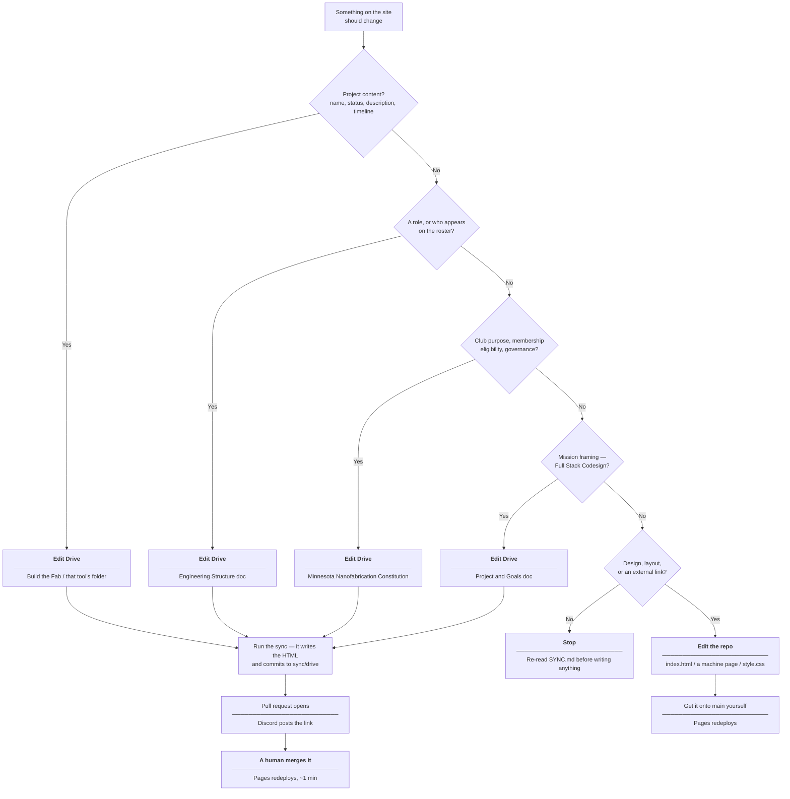

# Guide: Change Site Content

Where to make an edit when something on the site is wrong or out of date. Almost all
content is mirrored from the club's **Ultra Hardcore Chip Codesign** Google Drive, which
is authoritative over this repo — so for most changes **the file to edit is not in the
repo at all.**

---

## Decide where the edit belongs



**The Drive path has one more step than it used to.** Editing Drive gets you a proposal, not
a published page; merging the pull request is what publishes. See
[Reviewing a Proposed Update](../operations/reviewing-changes.md).

The same routing as a table:

| Section on the site | Ground truth | Edit here |
| --- | --- | --- |
| About the Club, Get Involved | `Minnesota Nanofabrication Constitution` | Drive |
| Full Stack Codesign | `Project and Goals`, and `Design the IC/` for the second half | Drive |
| Current Projects | that machine's folder under `Build the Fab` | Drive |
| A machine page — status, what it does, subsystems | that machine's `[MASTER]` doc | Drive |
| A machine page's timeline table | that machine's own timeline doc | Drive |
| A machine page's `Lead:` line | a **sentence** in that machine's doc naming the person | Drive |
| Team — roles and roster | `Engineering Structure` | Drive |
| Colours, spacing, markup, nav | `style.css`, `index.html`, the machine pages | repo |
| The three external links and the contact address | listed below | repo |

On roles the `Engineering Structure` doc **always wins**, including over the
Constitution's officer signature block. That is a settled decision, not a judgement call
to remake — see [Change a Publishing Rule](change-rules.md) for why.

---

## What breaks if you edit the HTML instead of Drive

**A hand-edit to project copy in `index.html` or a machine page is undone by the next sync,
with no warning and no failure.** The sync agent reads the Drive folders, diffs their
meaningful content against the HTML, and rewrites the section to match. Your sentence is not in
Drive, so the diff reads it as drift and overwrites it. The revert arrives as a pull request
rather than as a published commit, which puts a reviewer in front of it — but the proposal says
only what changed relative to Drive, nothing flags that a human wrote the old text on purpose,
and merging it is the expected action. The edit survives in `git log` and nowhere else, and the
person who made it finds out by noticing the site reverted — typically within four days, on the
next Monday or Thursday run.

An uncommitted edit is not protected either. The workflow runs on a fresh container that checks
out `main`, so your working tree is invisible to it: the sync proposes the revert regardless,
and your edit is simply never in the comparison. (The deleted local script *did* refuse to run
against a dirty tree — that guard went with it, along with the outage it caused whenever
somebody left the repo dirty.)

Editing Drive avoids all of this: the change is in the authoritative copy, so every future sync
reproduces it instead of fighting it.

---

## Repo-only content that must be preserved

Four items on the site are deliberately not Drive-sourced. A sync that "cleans up
unsourced content" would delete them, so they are carved out explicitly by SYNC.md rule 2:
the never-invent rule governs *claims*, not *links*.

| Content | Where | Why it stays |
| --- | --- | --- |
| `https://cse.umn.edu/ece/joseph-talghader` | Team, `index.html` | Advisor's public UMN faculty page |
| `https://docs.hackerfab.org/home` | About, `index.html`; `stepper.html` | Public Hacker Fab reference docs |
| `https://arxiv.org/pdf/2510.15082` | `stepper.html` | CMU stepper paper the build draws on |
| `jin00404@umn.edu` | Get Involved, `index.html` | The one email published on the site, added at Leonard's request 2026-08-18 |

!!! warning "One address, and only one"
    `jin00404@umn.edu` is the sole email the site publishes. Members' and the advisor's
    addresses appear in Drive docs and must not be copied onto the page — those are
    personal addresses on a public, search-indexed page, and appearing in an internal Drive
    doc is not consent to being published.

Before adding a new external link, open it and confirm it resolves and points at the right
subject. Do not reconstruct a URL from memory: a guessed link is an unverifiable claim
wearing an `<a>` tag, and a wrong one sends readers of a club page somewhere the club never
vetted.

---

## Run a sync now instead of waiting for the next slot

The scheduled workflow fires Monday and Thursday at 13:13 UTC — 08:13 Central in summer — so an
unforced Drive edit is proposed within four days, and published whenever someone merges that
proposal. To get the proposal sooner, trigger a run: **Actions → Sync from Drive → Run
workflow**, or

```bash
R=Minnesota-Nanofabrication-Club/club_website
gh workflow run "Sync from Drive" --repo "$R"
gh run watch --repo "$R"
```

Everything the run prints is on that run's page. There is no log file on anyone's machine.

Or drive it interactively from Claude Code inside a clone of the repo:

```
Sync the club website from Google Drive following SYNC.md.
```

If the run logs `No commit made — the site already matches Drive.`, the site already matched
Drive — a normal outcome, not a failure. See
[Anatomy of a Sync Run](../operations/sync-run.md) for every other branch.

If it logs `Opened: <url>`, the edit is waiting for review. Merge it to publish:

```bash
gh pr diff  --repo "$R" sync/drive
gh pr merge --repo "$R" sync/drive
```

!!! warning "Running the sync is not publishing"
    The workflow's last act is opening a pull request; the site is unchanged until someone
    merges it, and nothing merges on a timer. If your Drive edit still is not live, check
    `gh pr list --repo "$R" --head sync/drive` before re-running anything.

---

## Preview locally

```bash
python3 -m http.server 8000
```

Then open `http://localhost:8000/index.html`. There is no build step, no dependency
install, and no framework — the files served are the files deployed, so what renders
locally is what GitHub Pages will render from `main`.

---

## Common pitfalls

- **Hand-editing project copy in `index.html` or a machine page.** Undone by the next sync's
  proposal, in a diff that looks like every other routine sync. Edit the tool's `Build the Fab`
  folder instead.
- **Committing to `sync/drive`.** That branch is force-pushed from current `main` on every run
  that proposes anything, so what you put there is destroyed without warning. Put repo-side
  edits on `main`.
- **Assuming a completed sync means a published site.** The run proposes; a merge publishes.
- **Fixing the Team section in the HTML.** Roles come from `Engineering Structure`; the
  HTML edit is reverted and the underlying doc is still wrong.
- **Deleting an external link or the contact address as "unsourced".** Those four items are
  authorized in SYNC.md rule 2 and must be preserved through every sync.
- **Adding a member's or the advisor's email.** Only `jin00404@umn.edu` is published.
- **Forgetting the footer date.** Any content change must update the `.synced` span in the
  `index.html` footer. No machine page carries a `.synced` span — the date lives in one place
  only.
- **Adding a `Lead:` line because you know who is running the build.** It has to be written
  down in that machine's Drive doc first. See
  [One page per machine](../data-contracts.md#one-page-per-machine).
- **Introducing a framework, CDN link, or build step for a layout tweak.** The site is
  plain HTML and CSS with no external assets, and that is a rule, not an accident — see
  [design principles](../architecture/design-principles.md).
