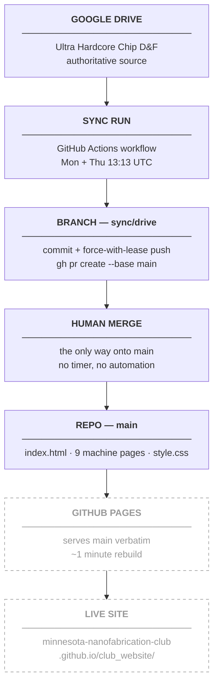

# Deployment

How a commit on `main` becomes the live site, and how to preview changes before they get
there. What produces those commits is in [Anatomy of a Sync Run](sync-run.md), and how they
get onto `main` is in [Reviewing a Proposed Update](reviewing-changes.md). **There is no build
step — GitHub Pages serves the files exactly as they sit in the repo — and nothing reaches
`main` except by a human merging a pull request.**

---

## Contents

- [The published site](#the-published-site)
- [No build step](#no-build-step)
- [Local preview](#local-preview)
- [When a merge does not appear](#when-a-push-does-not-appear)
- [Why the merge has to be human-authored](#why-the-merge-is-human-authored)
- [What is not in the repo](#what-is-not-in-the-repo)

---

## The published site

GitHub Pages serves `main` at:

```
https://minnesota-nanofabrication-club.github.io/club_website/
```

Any commit landing on `main` triggers a rebuild automatically — and under the current design
that means a merged pull request. The new version is live in about a minute. Nothing in the
repo configures this and no workflow file is involved — Pages watches the branch.

The full path from a Drive edit to a live page:



The dashed nodes are outside the repo: nothing in version control controls them, and nothing
in the sync scripts can observe them. **`HUMAN MERGE` is the only node with no automation
behind it**, and it is where the path stops until someone acts.

---

## No build step

The site is plain HTML and CSS — no frameworks, no external assets, no compile, no bundler,
no generator. Tracked source:

| File | Role |
| --- | --- |
| `index.html` | Home — About, Full Stack Codesign, Current Projects, Team, Get Involved |
| One page per machine | `stepper.html`, `sputterer.html`, `tube-furnace.html`, `etcher.html`, `spinner.html`, `developer.html`, `probe-station.html`, `ultrasonic-cleaner.html`, `wafer-arm.html` |
| `style.css` | The single shared stylesheet |
| `sitemap.xml`, `robots.txt` | Generated and static respectively — see [SEO](../guides/seo.md) |

Ten pages in total: the home page plus one per subfolder of `Build the Fab`.

**Why this constraint is worth keeping.** What Pages serves is byte-for-byte what is in the
repo, so `git show HEAD:index.html` is the page — there is no build output to inspect, no
lockfile to drift, no toolchain to keep installed anywhere, and no category of "works locally,
breaks in CI" failure. It also bounds the unattended agent: a scheduled run edits HTML that
renders directly, so a mistake is visible on the page rather than buried in a build artifact.
Preserving the design and the no-build rule is publishing rule 5, and a change that introduces
a build step breaks the deployment model, not just the styling.

!!! warning "Do not hand-edit project copy"
    Structure, layout and CSS are safe to edit directly. Project *content* — statuses,
    descriptions, timelines, leads, the team list — is rewritten from Drive on the next sync,
    so a hand edit there comes back as a proposal that reverts it, at most four days later, in
    a diff that reads like any other routine sync. Change the Drive doc instead. Which folder
    feeds which page is in [Data contracts](../data-contracts.md).

---

## Local preview

Because there is no build step, previewing means serving the folder:

```bash
python3 -m http.server 8000     # from the repo root
```

Then open:

```
http://localhost:8000
```

Stop the server with `Ctrl-C`.

Opening `index.html` directly from the filesystem mostly works, but serve over HTTP when
checking anything path-sensitive — a `file://` page resolves relative links differently from
the way Pages does, so a broken machine-page link or a missing `style.css` can look fine
locally and fail once published. With nine subpages cross-linked from the nav, that is the
error worth checking for.

Note the URL depth difference: the published site lives under the `/club_website/` path
segment while the local server serves the same files from the root. Relative links behave
identically under both; an absolute path such as `/style.css` works locally and `404`s on
Pages. Keep every internal link relative.

---

## When a merge does not appear { #when-a-push-does-not-appear }

The commit is on `origin/main` but the page has not changed. In order of likelihood:

| Cause | Check | Fix |
| --- | --- | --- |
| Not enough time | Under a minute since the merge | Wait. |
| Browser cache | Hard reload — `Cmd-Shift-R` — or an incognito window | Nothing; the cache was stale, not the site. |
| The change was never merged | `gh pr list --head sync/drive --state open` | Review and merge it — [Reviewing a Proposed Update](reviewing-changes.md) |
| A Pages build failed | The repository's **Actions** tab on GitHub | Read the build log there; Pages reports failures nowhere else. |
| Pages settings changed | Repository **Settings → Pages** | Confirm the source is still `main`. See below. |

Confirm the repo side first — these rule out everything upstream:

```bash
gh pr list --repo Minnesota-Nanofabrication-Club/club_website \
  --head sync/drive --state all --limit 5
git fetch origin
git log --oneline -3 origin/main
```

If the change is in `origin/main`, the pipeline did its job and the problem is on the Pages
side. If it is sitting in an open pull request, the pipeline also did its job — publishing is
the part that has not happened. If it is neither, start from
[Troubleshooting](troubleshooting.md#the-site-looks-stale).

---

## Why the merge has to be human-authored { #why-the-merge-is-human-authored }

The sync workflow has `contents: write`, so a step that pushed straight to `main` would be
mechanically possible. It does not, for the review reasons in
[Reviewing a Proposed Update](reviewing-changes.md) — and there is a second, purely mechanical
reason the current arrangement is the tidy one.

**A push made with the built-in `GITHUB_TOKEN` does not trigger workflow runs.** That is a
documented GitHub rule, and it is why the sibling repo's daily job calls its Pages deploy
directly rather than relying on `on: push`. This repo uses classic branch-based Pages, served
by GitHub's own managed `pages-build-deployment`, so it is not obviously subject to that rule —
but the question never has to be answered here. The only thing the workflow pushes is
`sync/drive`, which Pages does not serve. `main` moves when a **person** merges the pull
request, and a user-authored merge rebuilds Pages the same way any hand-pushed commit does.

!!! note "If a future change makes the workflow write `main` directly, this becomes live again"
    The remedy would be a fine-grained personal access token with `contents: write`, set as a
    secret and passed to `actions/checkout` as `token:` — a push made with a PAT does fire the
    downstream build. Verify the site actually changed after the first such run; the failure
    mode is a commit that lands on `main` while the published page does not move, with every
    log reporting success.

### The two designs this replaced

The sync used to run somewhere else, twice. A Claude Code cloud routine could read Drive and
compute the right change but got a **read-only** GitHub token, so `git push` and the GitHub
API both returned `403` — a scheduled job that did nothing observable. A `launchd` job on a
laptop replaced it and worked, until 2026-08-27, when a run died mid-response because the
machine slept; a schedule on a machine that can be closed is best-effort by construction. The
full history, and why neither is coming back, is in
[The Cloud Sync](cloud-sync.md#why-the-sync-lives-here).

!!! note "One Drive doc is still wrong about all of this"
    `Minnesota Nanofabrication Club (MNF)/Club Website — How It Works` describes the sync to
    club members and still describes an arrangement that no longer exists. It is member-facing
    documentation *about* the sync and is **never published to the site**. Flag the drift in a
    run summary; never edit it silently. See [Data contracts](../data-contracts.md).

---

## What is not in the repo

!!! warning "GitHub Pages settings are documented nowhere else"
    The Pages configuration — that the source is the `main` branch, the publishing directory,
    the site URL, and any custom-domain or HTTPS setting — lives in the repository's
    **Settings → Pages** on GitHub. No file in this repo records it, no script reads it, and
    no check would notice it changing. A person with admin access can silently switch the
    source branch or disable Pages, and the only symptom is that merges stop appearing while
    every log in the sync pipeline continues to report success. If deployment breaks with a
    clean `origin/main`, check that page before anything else.

Also outside version control, and equally invisible to the pipeline: the repository's Actions
secrets (`CLAUDE_CODE_OAUTH_TOKEN`, `GDRIVE_SERVICE_ACCOUNT_JSON`, `DISCORD_WEBHOOK_URL`,
`DISCORD_MENTION`), the Google Cloud service account and the Drive sharing grant that backs it,
the Discord webhook itself, and the repository's pull-request settings. Every one of them can
be changed or revoked by someone with the right access, and the only symptom is a failing or
silently useless run — see [The secrets](cloud-sync.md#the-secrets).

---

[← Troubleshooting](troubleshooting.md){ .md-button } [Architecture overview →](../architecture/overview.md){ .md-button .md-button--primary }
