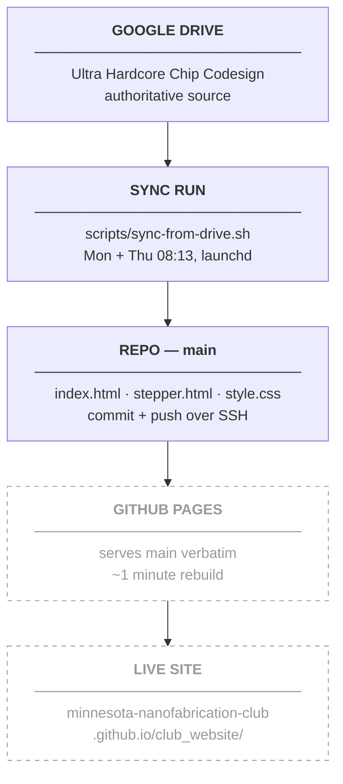

# Deployment

How a commit on `main` becomes the live site, how to preview changes before they get there,
and why the whole pipeline runs from a laptop instead of the cloud. What produces those
commits is in [Anatomy of a Sync Run](sync-run.md). **There is no build step — GitHub Pages
serves the files exactly as they sit in the repo.**

---

## Contents

- [The published site](#the-published-site)
- [No build step](#no-build-step)
- [Local preview](#local-preview)
- [When a push does not appear](#when-a-push-does-not-appear)
- [Why local and not a cloud routine](#why-local-and-not-a-cloud-routine)
- [What is not in the repo](#what-is-not-in-the-repo)

---

## The published site

GitHub Pages serves `main` at:

```
https://minnesota-nanofabrication-club.github.io/club_website/
```

Any push to `main` triggers a rebuild automatically. The new version is live in about a
minute. Nothing in the repo configures this and no workflow file is involved — Pages watches
the branch.

The full path from a Drive edit to a live page:



The dashed nodes are outside the repo: nothing in version control controls them, and nothing
in the sync scripts can observe them.

---

## No build step

The site is plain HTML and CSS — no frameworks, no external assets, no compile, no bundler,
no generator. Tracked source:

| File | Role |
| --- | --- |
| `index.html` | Home — About, Full Stack Codesign, Current Projects, Team, Get Involved |
| `stepper.html` | Maskless lithography stepper project page |
| `style.css` | The single shared stylesheet |

**Why this constraint is worth keeping.** What Pages serves is byte-for-byte what is in the
repo, so `git show HEAD:index.html` is the page — there is no build output to inspect, no
lockfile to drift, no toolchain to keep installed on the one laptop the sync runs from, and no
category of "works locally, breaks in CI" failure. It also bounds the unattended agent: a
scheduled run edits HTML that renders directly, so a mistake is visible on the page rather
than buried in a build artifact. Preserving the design and the no-build rule is publishing rule 5,
and a change that introduces a build step breaks the deployment model, not just the styling.

!!! warning "Do not hand-edit project copy"
    Structure, layout and CSS are safe to edit directly. Project *content* — statuses,
    descriptions, timelines, the team list — is rewritten from Drive on the next sync, so a
    hand edit there is reverted by the next run, at most four days later. Change the Drive
    doc instead. Which folder feeds which section is in
    [Data contracts](../data-contracts.md).

---

## Local preview

Because there is no build step, previewing means serving the folder:

```bash
cd /Users/leonardjin/Dev/ultra-hardcore-chip-codesign/club_website
python3 -m http.server 8000
```

Then open:

```
http://localhost:8000
```

Stop the server with `Ctrl-C`.

Opening `index.html` directly from the filesystem mostly works, but serve over HTTP when
checking anything path-sensitive — a `file://` page resolves relative links differently from
the way Pages does, so a broken `stepper.html` link or a missing `style.css` can look fine
locally and fail once published.

Note the URL depth difference: the published site lives under the `/club_website/` path
segment while the local server serves the same files from the root. Relative links behave
identically under both; an absolute path such as `/style.css` works locally and `404`s on
Pages. Keep every internal link relative.

---

## When a push does not appear

The commit is on `origin/main` but the page has not changed. In order of likelihood:

| Cause | Check | Fix |
| --- | --- | --- |
| Not enough time | Under a minute since the push | Wait. |
| Browser cache | Hard reload — `Cmd-Shift-R` — or an incognito window | Nothing; the cache was stale, not the site. |
| The commit is not actually on GitHub | `git rev-list origin/main..HEAD` after `git fetch` | [Push failed](troubleshooting.md#push-failed-after-retry) |
| A Pages build failed | The repository's **Actions** tab on GitHub | Read the build log there; Pages reports failures nowhere else. |
| Pages settings changed | Repository **Settings → Pages** | Confirm the source is still `main`. See below. |

Confirm the repo side first — it is one command and rules out everything upstream:

```bash
cd /Users/leonardjin/Dev/ultra-hardcore-chip-codesign/club_website
git fetch origin
git log --oneline -3 origin/main
```

If the change is in `origin/main`, the pipeline did its job and the problem is on the Pages
side. If it is not, start from [Troubleshooting](troubleshooting.md#the-site-looks-stale).

---

## Why local and not a cloud routine { #why-local-and-not-a-cloud-routine }

A scheduled cloud routine was the first design, and it does not work.

**Cloud routines get a read-only GitHub token on this repo.** `git push` and the GitHub API
both return `403`. The routine can read the repo, read Drive, and produce a perfectly correct
set of edits — and then it cannot publish any of them, which makes it a scheduled job that
does nothing observable. Granting write access requires a Claude Team or Enterprise plan.
Running the same agent locally sidesteps the problem entirely: git on the laptop already has
push access over SSH, the credentials are the user's own, and the whole loop works at no extra
cost.

The tradeoff is stated in [The Schedule](schedule.md#sleep-wake-and-off): the Mac has to be
on. Asleep at 08:13 on a scheduled day means the job runs on the next wake; off through the
whole slot means that run is skipped, which is harmless because the next one — Monday or
Thursday, never more than four days away — picks up everything.

!!! danger "The cloud routine still exists and is disabled"
    Do not re-enable it without first fixing the permission. Re-enabling it as-is produces a
    second scheduled agent that reads Drive, edits its own checkout, fails to push with `403`,
    and reports nothing useful — while the local job continues working. The result is two
    schedules where only one publishes, and log evidence split across two places. Fix the
    token permission first, or leave it disabled.

The README carried the opposite claim for a while — that the sync could not publish at all —
which was true only of the cloud design. Commit `99e3012` corrected it. The write-back path
was proved from a terminal on 2026-08-18 by deleting the Etcher project entry (`0593a4a`) and
watching the sync restore it (`7dd018c`).

!!! note "One Drive doc is still wrong about this"
    `Minnesota Nanofabrication Club (GopherFab)/Club Website — How It Works` still says the
    sync runs in the cloud and that "Nothing runs on anyone's laptop", which stopped being
    true at commit `99e3012`. It is member-facing documentation *about* the sync and is
    **never published to the site**. Flag the drift in a run summary; never edit it silently.
    See [Data contracts](../data-contracts.md).

---

## What is not in the repo

!!! warning "GitHub Pages settings are documented nowhere else"
    The Pages configuration — that the source is the `main` branch, the publishing directory,
    the site URL, and any custom-domain or HTTPS setting — lives in the repository's
    **Settings → Pages** on GitHub. No file in this repo records it, no script reads it, and
    no check would notice it changing. A person with admin access can silently switch the
    source branch or disable Pages, and the only symptom is that pushes stop appearing while
    every log in the sync pipeline continues to report success. If deployment breaks with a
    clean `origin/main`, check that page before anything else.

Also outside version control, and equally invisible to the pipeline: the SSH key that
authorizes the push, the Google Drive connector session, and the disabled cloud routine.

---

[← Troubleshooting](troubleshooting.md){ .md-button } [Architecture overview →](../architecture/overview.md){ .md-button .md-button--primary }
